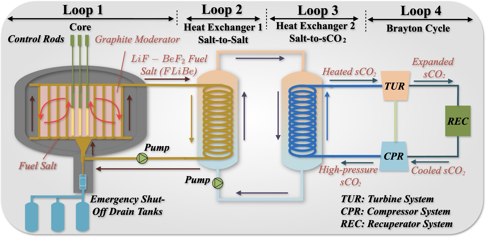
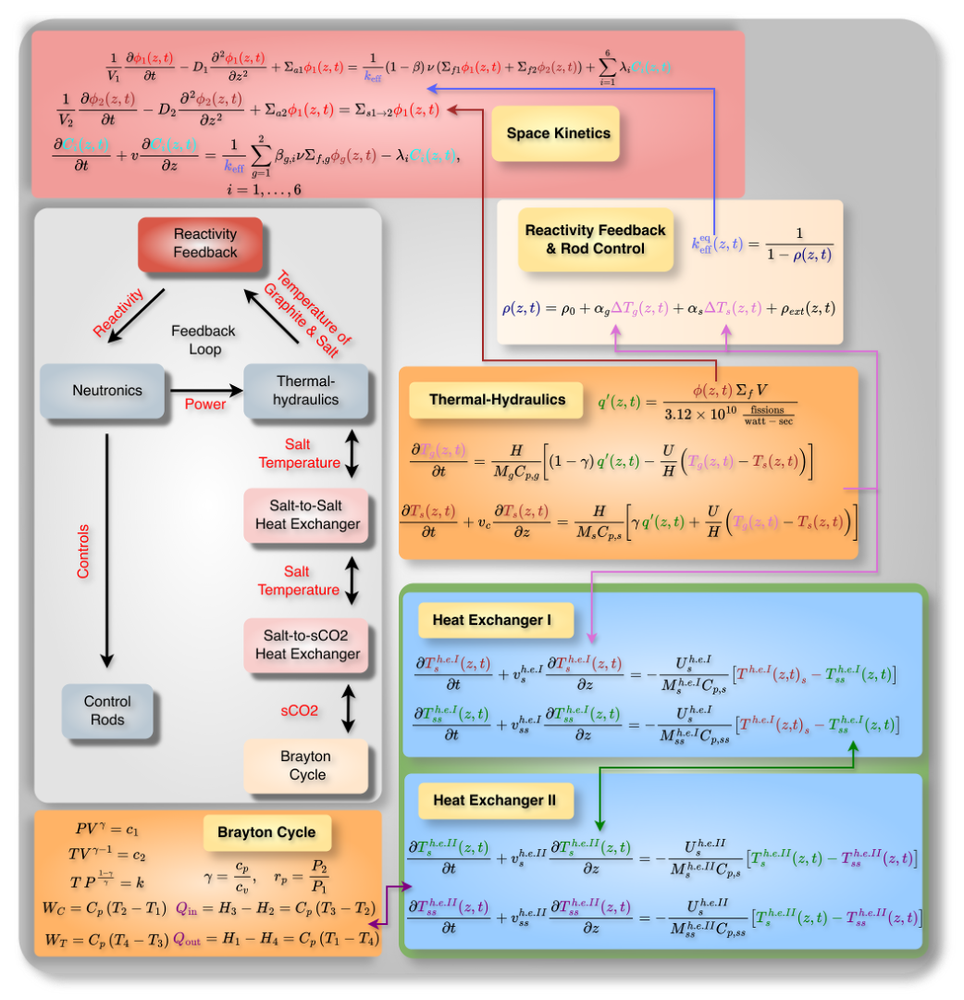
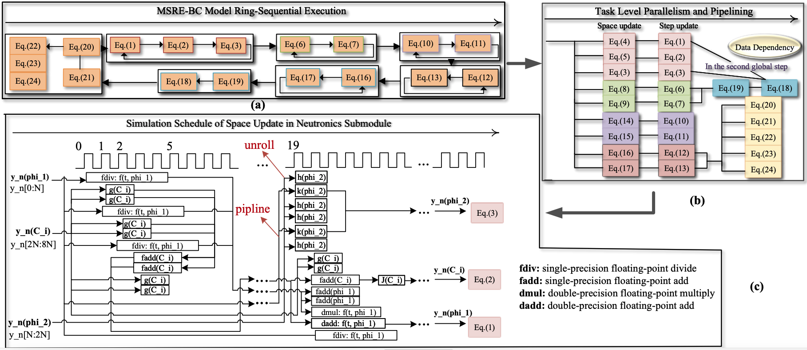
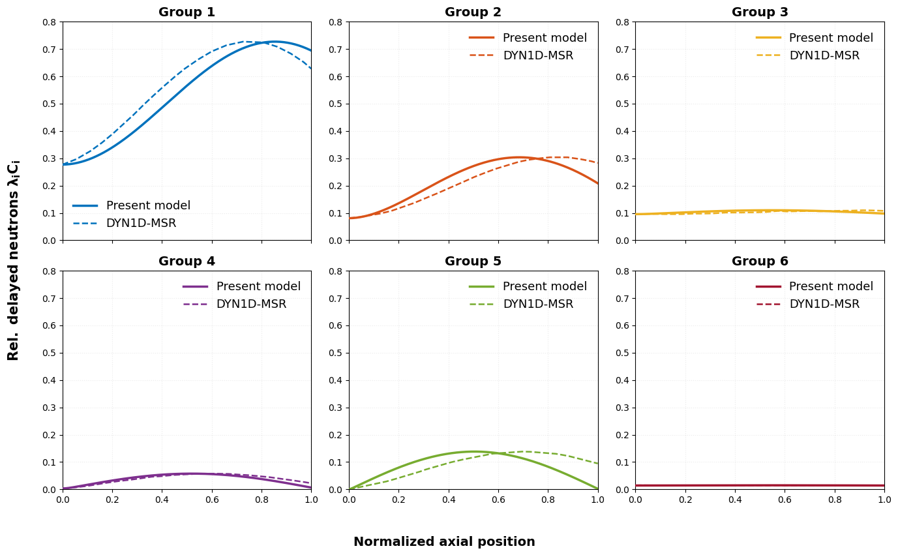

# 🚀 MSRE-BC – Real-Time Multiphysics Reactor Emulation (Python → C++ → FPGA)

High-performance multiphysics simulation and hardware acceleration of the Molten Salt Reactor Experiment (MSRE) with heterogeneous FPGA–CPU execution.

> 148× speedup over sequential CPU implementation  
> 106× faster-than-real-time (FTRT) hardware emulation  
> Semi-implicit PDE solver for stiff coupled reactor dynamics  

---

## 🔥 Project Overview

This project implements a full-stack engineering pipeline for real-time simulation of a multiphysics nuclear energy system:

- Neutron transport (space-dependent kinetics)
- Thermal-hydraulics (fuel & graphite heat transfer)
- Heat exchangers (advection PDEs)
- Brayton cycle thermodynamics
- Reactivity feedback control

The system was first developed in Python for validation, optimized in C++, and finally accelerated using FPGA (Vitis HLS) in a hardware-in-the-loop setup.

The result is a deterministic, faster-than-real-time emulator capable of handling stiff coupled PDE systems.

---

## 🧠 Engineering Challenge

Reactor multiphysics models are computationally difficult because:

- Strong numerical stiffness (multiple time scales)
- Tight coupling between neutronics and thermal feedback
- Axial precursor drift transport
- High computational cost of implicit PDE solvers
- Deterministic timing requirements for real-time emulation

Traditional CPU-based solvers cannot meet deterministic FTRT constraints due to latency variability.

This project solves that problem using:

- Semi-implicit Crank–Nicolson spatial discretization
- Adaptive RKF45 time integration
- Ring-sequential submodule execution
- Task-level FPGA parallelism
- Heterogeneous FPGA–CPU co-simulation

---

## 🏗 System Architecture

### Integrated Multiphysics System

<p align="center">
  
</p>


The MSRE core is coupled with two heat exchangers and a Brayton cycle energy conversion system.

---

### Solver & Data Flow

<p align="center">
  
</p>

- CN discretization for diffusion terms  
- Sparse tridiagonal operators  
- Embedded RKF45 adaptive integration  
- Submodule synchronization every 1 s  

---

## ⚡ Hardware Acceleration

### Heterogeneous Deployment

- Core PDE solvers → FPGA (Vitis HLS)
- Brayton cycle → CPU
- Unified 0.01 s hardware time step
- Pipelined task-level parallelism



---

### Performance

| Metric | Result |
|--------|--------|
| Sequential CPU latency | > 1 s / step |
| FPGA latency | 94 µs / step |
| Speedup vs CPU | 148.4× |
| Faster-than-real-time | 106× |

The FPGA implementation runs at 300 MHz on a Xilinx VCU118 platform.

---

### Hardware Setup

<p align="center">
  
</p>

Hardware-in-the-loop configuration:
- Xilinx VCU118 FPGA
- Intel i9 host CPU
- DAC + oscilloscope output
- Deterministic clock scheduling

---

## 📈 Validation & Stability

### Transient Stability (+50 pcm perturbation)

<p align="center">
  
</p>

The system stabilizes rapidly under positive and negative reactivity insertions.

---

### Spatial Verification (Axial Profiles)

<p align="center">
  
</p>

Validated against:
- ORNL 3D MSRE model
- DYN1D-MSR benchmark

Axial neutron flux and delayed neutron precursor transport match reference physics trends.

---

## 🛠 Implementation Evolution

### 🐍 Python (Research Prototype)
- Rapid prototyping
- Solver verification
- Literature benchmarking

### ⚙️ C++ (Performance Version)
- Sparse matrix operators (Eigen)
- Ring-sequential architecture
- Latency profiling & optimization

### 🔌 Vitis HLS C++ (Production FPGA Acceleration)
- C++ kernels and host-side orchestration for Vitis HLS flow
- Task-level parallelism
- Floating-point DSP acceleration
- Deterministic timing
- Hardware-in-the-loop validation

---

## 📂 Repository Structure

```text
msr1d-portfolio/
├── Readme.MD                  # Project overview, architecture, and performance
├── docs/
│   └── images/                # System diagrams and validation figures used in README
├── python/                    # Research/prototyping implementation (model + solvers + analysis)
│   ├── main.py
│   ├── neutronics.py
│   ├── thermal_hydraulics.py
│   ├── HX1.py
│   ├── HX2.py
│   ├── ode_solver.py
│   └── simulation_results/    # Generated datasets and plots
├── cpp/                       # Performance-focused CPU implementation (CMake project)
│   ├── CmakeLists.txt
│   ├── include/               # C++ headers
│   ├── src/                   # C++ source implementation
│   ├── build/                 # Generated build artifacts (can be gitignored)
│   └── output.txt             # Example output/log
└── vitis/                     # Vitis HLS-targeted C++ code for FPGA acceleration
    ├── program.cpp
    ├── simulation_test.cpp
    ├── ode_solver_*.cpp
    └── *.hpp
```

---

## 🎯 Technical Highlights

- Custom semi-implicit solver for stiff PDE systems
- Sparse tridiagonal matrix operators (no full inversion)
- Adaptive time-stepping integration
- Task-level hardware parallelism
- Deterministic real-time emulation
- Verified multiphysics coupling
- 100×+ acceleration over real time

---

## 📜 Publication

Based on research submitted to *Annals of Nuclear Energy*:

> Semi-Implicit FDTD Modeling and Real-Time Emulation of Molten Salt Reactor Experiment with Heterogeneous FPGA-CPU Acceleration

---

## 📌 Notes

This repository contains engineering implementations of the solver and hardware acceleration framework.  
Detailed mathematical derivations are available in the associated manuscript.

---
